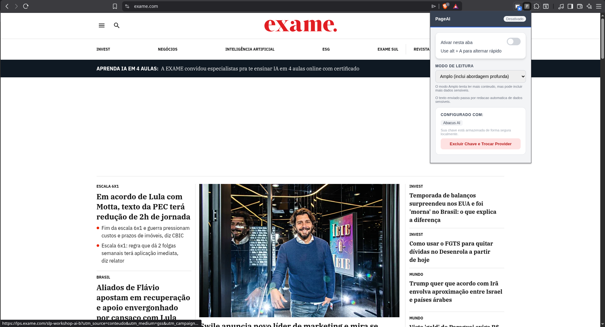
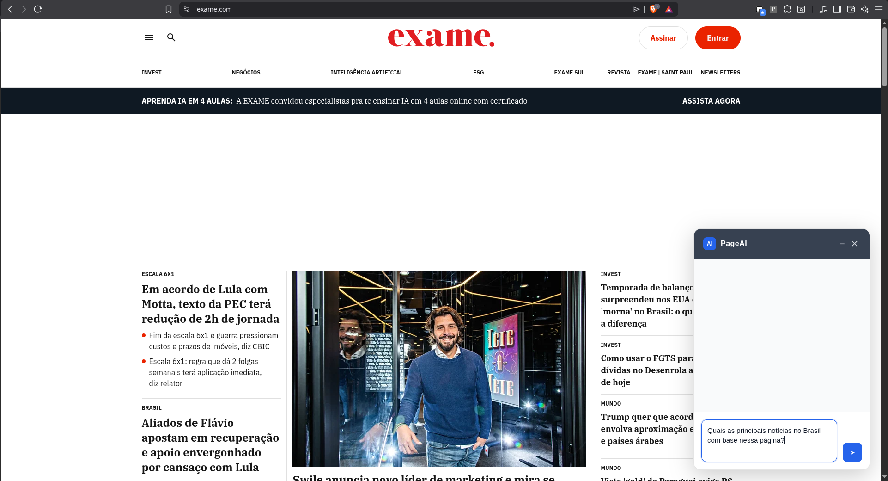
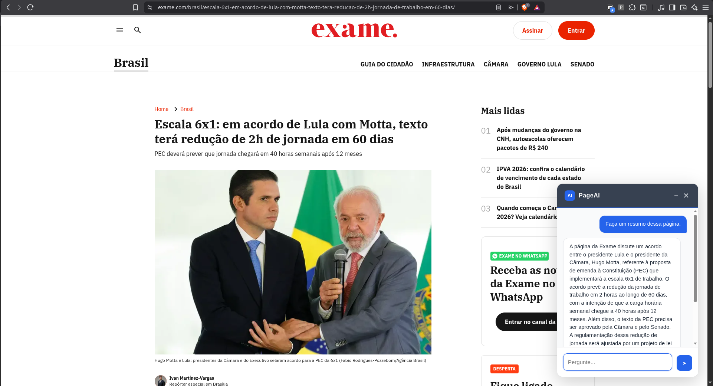

# PageAI 🤖

## PT-BR

Companheiro de IA para abas isoladas no navegador.

O PageAI transforma qualquer pagina estatica em um chat contextual por aba, com isolamento real e privacidade.

### Por que?

- **Privacidade**: suas chaves ficam no navegador e o contexto passa por redacao de PII.
- **Isolamento**: cada aba tem seu proprio ciclo de vida e estado.
- **Contexto por aba**: conversas nao vazam entre sites ou tarefas.

Achei que seria "so uma extensao". Agora estou debatendo ciclo de vida de abas e contexto as 1h da manha.

### Funcionalidades

- Multi-provedor
- Traga sua propria API key
- Isolamento por aba
- Suporte a Chromium
- Armazenamento local
- Interacoes com contexto

### Arquitetura

- **Popup**: configuracao de provedor, chave e ativacao por aba.
- **Content script**: coleta contexto apenas na aba ativa e injeta o chat.
- **Service worker**: orquestra estado e roteamento de mensagens.
- **Armazenamento local**: chaves e preferencias ficam no navegador.
- **Adapters de provedor**: interface unica para varias APIs.

### Capturas

### Capacidades

- **Analise multimodal**: ve descricoes de imagens, titulos (H1) e detecta videos.
- **Multi-provedor**: suporte para **Anthropic (Claude)**, **OpenAI (GPT-4o)**, **Google (Gemini 1.5)** e **Abacus AI**.
- **Conhecimento hibrido**: responde com base na pagina ou busca conhecimento externo quando necessario.
- **Interface moderna**: chat minimalista com modo de minimizacao.
- **UX inteligente**: campo de texto expansivel e atalhos rapidos.
- **Privacidade**: chaves de API armazenadas localmente.
- **Privacidade reforcada**: redacao automatica de PII antes do envio.

### Instalar

1. Acesse `chrome://extensions`.
2. Ative o **"Modo do desenvolvedor"**.
3. Clique em **"Carregar sem compactacao"** e selecione a pasta do projeto.

### Configuracao

1. Abra o popup da extensao.
2. Escolha o provedor e informe sua **API key**.
3. Clique em **"Configurar PageAI"**.
4. Ative **"Ativar nesta aba"**.

### Privacidade e seguranca

- O contexto passa por redacao automatica de dados sensiveis.
- Dados sensiveis comuns (email, telefone, CPF, cartao) sao redigidos automaticamente.
- A extensao funciona em qualquer site, mas sempre exige revisao do contexto.
- A extensao so injeta o script na aba ativa quando voce clica em ativar.

### Diferencial tecnico escondido

- Browser APIs
- Isolamento e contexto
- UX aplicada
- IA e seguranca
- Arquitetura de extensao

### Proximo nivel

- Memoria por dominio
- RAG local
- Resumo automatico de docs
- Modo "pair programmer"
- Analise de PR do GitHub
- Conversar com paginas de documentacao

### Atalhos

- **Abrir/Fechar Chat**: `Alt + A`.
- **Enviar Mensagem**: `Enter`.
- **Quebrar Linha**: `Shift + Enter`.

*Nota: Requer API key valida do provedor escolhido.*

---

## English

AI companion for isolated browser tabs.

PageAI turns any static page into a per-tab contextual chat, with real isolation and privacy.

### Why?

- **Privacy**: keys stay in the browser and context goes through PII redaction.
- **Isolation**: each tab has its own lifecycle and state.
- **Per-tab context**: conversations do not leak across sites or tasks.

I thought it would be "just an extension". Now I am debating tab lifecycle and context at 1 a.m.

### Features

- Multiple AI providers
- Bring your own API key
- Tab isolation
- Chromium support
- Local storage
- Context-aware interactions

### Architecture

- **Popup**: provider config, key and per-tab activation.
- **Content script**: collects context only in the active tab and injects the chat.
- **Service worker**: orchestrates state and message routing.
- **Local storage**: keys and preferences stay in the browser.
- **Provider adapters**: one interface for multiple APIs.

### Screenshots

### Capabilities

- **Multimodal analysis**: sees image descriptions, H1 titles, and detects videos.
- **Multi-provider**: supports **Anthropic (Claude)**, **OpenAI (GPT-4o)**, **Google (Gemini 1.5)** and **Abacus AI**.
- **Hybrid knowledge**: answers from the page or fetches external knowledge when needed.
- **Modern UI**: minimal chat with a minimize mode.
- **Smart UX**: expandable input and quick shortcuts.
- **Privacy**: API keys stored locally.
- **Extra privacy**: automatic PII redaction before sending.

### Install

1. Open `chrome://extensions`.
2. Enable **"Developer mode"**.
3. Click **"Load unpacked"** and select the project folder.

### Setup

1. Open the extension popup.
2. Choose your provider and enter your **API key**.
3. Click **"Configurar PageAI"**.
4. Enable **"Ativar nesta aba"**.

### Privacy and security

- Context goes through automatic sensitive-data redaction.
- Common PII (email, phone, CPF, card) is redacted.
- Works on any site, but always requires context review.
- Script is injected only in the active tab when you enable it.

### Hidden technical edge

- Browser APIs
- Isolation and context
- Applied UX
- AI and security
- Extension architecture

### Next level

- Domain memory
- Local RAG
- Doc auto-summary
- Pair programmer mode
- GitHub PR analysis
- Talk to docs

### Shortcuts

- **Open/Close Chat**: `Alt + A`.
- **Send Message**: `Enter`.
- **New Line**: `Shift + Enter`.

*Note: Requires a valid API key from the selected provider.*
